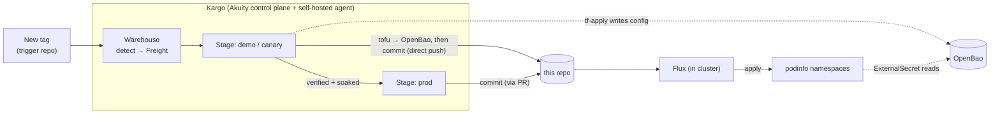

# gitops-tenants

**GitOps source of truth for the Kargo + Flux progressive-delivery demo.**

This repo describes *what should be running on the cluster*. **Kargo** promotes new
versions *into* this repo — environment by environment, behind verification and approval
gates — and **Flux** watches the repo and applies each change. Kargo never touches a
cluster directly; **the commit here is the hand-off**, and Flux does the actual deploy.

> ⚠️ Demo / workshop repo — **generic content only** (podinfo + version pins, dev-mode
> OpenBao). No real infrastructure. `podinfo` and the module tags stand in for "the thing
> being promoted."

## The whole loop in one line

**Tag a trigger repo → Kargo promotes & verifies the version (writing here) → Flux
applies it → `podinfo` shows the new version**, one environment at a time, with prod
gated by a human.

The trigger repos hold no logic — just **git tags** that represent a "version":
- `tenant-platform-module` → drives the **fleet** demo
- `tf-podinfo-module` → drives the **infra** demo

---

## Two demos

| Demo | Stages | Trigger repo (Warehouse) | What it shows |
|---|---|---|---|
| **Infra (Pattern A)** | `infra-demo` → `infra-prod` | `tf-podinfo-module` tags | Single-env promotion: tofu writes config to OpenBao, Flux applies. Demo auto; prod PR-gated. |
| **Fleet** | `tenant-a` → `tenant-b` + `tenant-c` | `tenant-platform-module` tags | A tenant fleet: `tenant-a` is the auto **canary** (verified + soaked), then fan out to prod tenants **b/c** via PR. |

Both sit on a **shared platform** (installed once, Flux-managed): External-Secrets,
OpenBao, Reloader, cert-manager, ingress-nginx.

---

## Pattern A — how a promotion works (tofu never touches the cluster)



During a promotion Kargo runs: `git-clone → tf-plan → tf-apply → tf-output →
yaml-update → git-commit → git-push → flux-reconcile-wait`. **tofu uses the `vault`
provider against OpenBao — so it needs no kubeconfig/cluster creds.** It writes a
versioned config to OpenBao, then `yaml-update` repoints the app's `ExternalSecret` to
that new versioned key, commits, and Flux applies. Because "which version is served"
lives in the committed `ExternalSecret` key, the **prod PR truly gates it** — tofu writes
to OpenBao immediately, but prod keeps serving the old version until the PR merges.

---

## Repository layout

```
platform/                     # shared services — Flux HelmReleases + config (installed once)
  addons/                     #   OpenBao, External-Secrets, Reloader, cert-manager, ingress-nginx + HelmRepositories
  config/                     #   ClusterSecretStore (ESO → OpenBao) + cert-manager CA issuer  (dependsOn addons)

infra/                        # INFRA demo (Pattern A) — two environments
  tofu/ app/ kubeconfig       #   infra-demo   (tofu writes secret/infra-demo-<ver>)
  prod/tofu/ prod/app/ …      #   infra-prod   (tofu writes secret/infra-prod-<ver>)

fleet/tenants/                # FLEET demo — one self-contained slice per tenant
  tenant-a/ tenant-b/ tenant-c/
    tofu/main.tf              #   writes this tenant's config bundle to OpenBao
    app/resources.yaml        #   podinfo Deployment + Service + Namespace
    app/externalsecret.yaml   #   pulls the config from OpenBao (version-pinned key)
    app/ingress.yaml          #   cert-manager Certificate + nginx Ingress (real components)
    app/kustomization.yaml    #   bundles the app + sets the replica count
    kubeconfig                #   lets the promotion's flux-reconcile step reach the cluster

clusters/kargo-tf-demo/       # WIRING (app-of-apps) — reconciled by the root cluster-config Kustomization
  kustomization.yaml
  kustomizations.yaml         #   Flux Kustomizations: platform-addons + platform-config
```

**Where a promotion writes** (the committed change that gates prod):
```yaml
# <env>/app/externalsecret.yaml  — yaml-update repoints this key to the new version
spec:
  data:
    - remoteRef: { key: tenant-a-1.4.0, property: greeting }   # was tenant-a-1.3.0
```
The fleet also bumps the replica count in `app/kustomization.yaml` (replicas = the
module's minor version, so a bump visibly rescales).

---

## Shared platform (`platform/`, Flux-managed)

Prerequisites are managed by **Flux as HelmReleases** (not imperative `helm install`),
so they're version-controlled and reproducible on a cluster rebuild:

- **OpenBao** (hub secrets, dev mode) — the KV store tofu writes to and ESO reads from
- **External-Secrets Operator (ESO)** — syncs OpenBao values into namespace Secrets
- **Reloader** — restarts workloads when a Secret changes
- **cert-manager** — issues each tenant's TLS cert (from the CA issuer in `config/`)
- **ingress-nginx** — routes each tenant's Ingress
- **ClusterSecretStore + CA issuer** (`platform/config`) — wires ESO → OpenBao and the
  `selfsigned → demo-ca → demo-ca-issuer` chain

Delivered by two Kustomizations with ordering: `platform-addons` → `platform-config`
(`dependsOn`).

> Notes: OpenBao runs in **dev mode** (ephemeral) — a demo choice, not production.
> A CoreDNS shim (`tenant-*.demo.local` → the ingress) is applied out-of-band (see the
> `cluster-addons/` folder in the workshop repo); it stands in for external-dns + real DNS.

---

## How a promotion flows (both demos)

1. **Warehouse** discovers a new tag on the trigger repo → creates **Freight**.
2. **Canary/demo auto-promotes** → Kargo runs the Pattern A steps → **direct push to `main`**.
3. Flux applies it → podinfo rolls (fleet also re-issues cert + ingress + rescales).
4. **Verification** (gate): an `AnalysisRun` hits the tenant's **real ingress**
   (`https://<tenant>.demo.local/`) until it reflects the new version — proving DNS + TLS +
   routing + app, not just that a pod is up.
5. **Soak** → the Freight must bake `2m` before it's eligible for prod.
6. Promote to **prod** → a deliberate manual step; the tail is **PR-based**
   (`git-open-pr → git-wait-for-pr`, pauses for a human merge).
7. On merge, Flux applies the prod environment(s).

### Gates (auto up to pre-prod, explicit for prod)
| Gate | Where | Nature |
|---|---|---|
| **auto-promotion** | canary / demo (`ProjectConfig.promotionPolicies`) | automatic on new Freight |
| **verification** | canary / demo | automated post-deploy (AnalysisRun via the ingress) |
| **soak time** | prod eligibility (`requiredSoakTime: 2m`) | time-based bake |
| **manual + PR review** | **prod** | human: explicit promote **and** PR merge |

If canary verification **fails**, the Freight is never marked verified → **prod never
receives it** (a bad version halts at the canary).

---

## GitOps wiring (app-of-apps)

Everything is reconciled from Git by a single **root `cluster-config` Kustomization**
(`clusters/kargo-tf-demo/`). The only imperative **bootstrap seed** is:

1. Flux Operator (Helm) + **FluxInstance**
2. **GitRepository** `gitops-tenants`
3. the root **`cluster-config`** Kustomization

Past that seed, the platform Kustomizations (and thus all the HelmReleases) are
Git-managed. The **Kargo** config (Project, Warehouses, Stages, PromotionTasks,
AnalysisTemplates) lives in the Akuity control plane — applied from a separate `kargo/`
folder in the workshop repo, not here.

---

## Observe it

- **Flux UI** (Flux Operator status page) / `flux get kustomizations` — sources, kustomizations, HelmReleases, applied revisions.
- `kargo get stages --project kargo-flux-demo` — freight + verification status.
- OpenBao: `kubectl -n openbao exec openbao-openbao-0 -- sh -c 'VAULT_TOKEN=root vault kv get secret/<tenant>-<ver>'`.
- podinfo: `kubectl -n <ns> exec deploy/podinfo -- wget -qO- localhost:9898/` (greeting) — or through the ingress with a `Host: <tenant>.demo.local` header.
