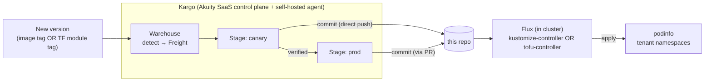

# gitops-tenants

**GitOps source of truth for the Kargo + Flux progressive-delivery demo.**

Flux watches this repo and applies each tenant "ring". **Kargo** promotes new
versions *into* this repo — ring by ring — behind verification and approval gates.
Kargo never touches a cluster directly; **the commit here is the hand-off**, and
Flux does the actual deploy.

> ⚠️ Demo / workshop repo — **generic content only** (podinfo + version pins,
> dev-mode OpenBao). No real infrastructure. The podinfo image / TF module tag
> stands in for "the thing being promoted."

## Two tracks, one pipeline

The repo runs the **same Kargo pipeline** over two different Flux executors:

| Track | Path | Executor | Kargo "bump" step | Tenants |
|---|---|---|---|---|
| **app** | `tenants/` | Flux **kustomize-controller** | `kustomize-set-image` (image tag) | `canary`, `prod` |
| **terraform** | `tf/` | Flux **tofu-controller** | `hcl-update` (module `?ref=`) | `tf-canary`, `tf-prod` |

Both are `Warehouse → canary → verify → prod`. Only the executor + the bump step differ —
which is exactly the point: **Kargo's progressive-delivery model is the same whether you
deliver manifests or Terraform.**

---

## The pattern



Kargo detects a new version → **writes to this repo** (bumps a pin). Flux (kustomize- or
tofu-controller) reconciles the commit and applies it. The two are decoupled — they only
meet at this repo.

---

## Repository layout

```
tenants/                    # APP track — podinfo via kustomize
  canary/ prod/             #   namespace + podinfo(Deployment/Service) + kustomization
                            #   version pin = images[].newTag  (kustomize-set-image bumps it)

tf/                         # TERRAFORM track — podinfo via a TF module
  tenants/
    canary/main.tf          #   kubernetes provider + module "podinfo" { source=…?ref=X, namespace }
    prod/main.tf            #   version pin = module ?ref=  (hcl-update bumps it)
                            #   module code = separate repo `tf-podinfo-module` (git-tagged per version)

platform/                   # cluster addons — Flux HelmReleases + ClusterSecretStore
  addons/                   #   OpenBao / External-Secrets / Reloader HelmReleases
  config/                   #   ESO ClusterSecretStore → OpenBao  (dependsOn addons)

clusters/kargo-tf-demo/     # WIRING (app-of-apps) — reconciled by the root cluster-config Kustomization
  kustomizations.yaml       #   Flux Kustomizations: tenant-canary/prod + platform-addons/config
  tofu.yaml                 #   tofu-controller RBAC (tf-runner) + tenant-canary-tf/tenant-prod-tf Terraform CRs
```

**Where a promotion writes:**
```yaml
# app track — tenants/<ring>/kustomization.yaml
images: [{ name: ghcr.io/stefanprodan/podinfo, newTag: "6.14.0" }]
```
```hcl
# terraform track — tf/tenants/<ring>/main.tf
module "podinfo" { source = "git::https://github.com/himeshpanc/tf-podinfo-module.git//?ref=6.15.0" }
```

---

## Platform addons (`platform/`, Flux-managed)

Platform prerequisites are managed by **Flux as HelmReleases** (not imperative `helm install`),
so they're version-controlled and show in the Flux UI:

- **OpenBao** (hub secrets, dev mode) — KV store the tenants pull from
- **External-Secrets Operator (ESO)** — syncs secrets from OpenBao into namespaces
- **Reloader** — restarts workloads when a secret/config changes
- **ClusterSecretStore** (`platform/config`) — wires ESO → OpenBao

Delivered by two Kustomizations with ordering: `platform-addons` → `platform-config` (`dependsOn`).

> Notes: ESO's oversized CRDs are applied server-side out-of-band (a known ESO+Helm limitation),
> and OpenBao runs in **dev mode** (ephemeral). Both are demo choices, not production.

---

## Terraform track — full tenant provisioning

The `tf-podinfo-module` (separate, git-tagged repo) provisions a **complete tenant**:
- podinfo Deployment + Service
- an **ExternalSecret** pulling `tenant-config` from the **OpenBao** hub → a K8s Secret
- podinfo's greeting wired from that secret (`PODINFO_UI_MESSAGE`)
- a **Reloader** annotation so a secret change auto-restarts the pod

Flux **tofu-controller** applies each tenant root (the `Terraform` CRs live in `clusters/`).
Kargo's **`hcl-update`** step bumps the module `?ref=`; verification checks that podinfo's
greeting reflects the OpenBao value — proving the whole **tofu → ESO → Reloader** chain, not
just that a pod is up.

**Secret rotation** is continuous and separate from Kargo: change the value in OpenBao → ESO
resyncs (~15s) → Reloader restarts podinfo. Kargo promotes the *wiring*; ESO+Reloader handle
live *values*.

---

## How a promotion flows (both tracks)

1. **Warehouse** discovers a new version (image tag / TF module tag) → creates **Freight**.
2. Promote to **canary** → Kargo: `git-clone → (kustomize-set-image | hcl-update) → git-commit → git-push` (**direct to `main`**).
3. Flux (kustomize- or tofu-controller) applies the canary ring → podinfo rolls.
4. **Verification** (gate): an `AnalysisRun` polls the canary until it reflects the promoted version → Freight is "verified in canary".
5. Promote to **prod** → same steps; the app track's prod is **PR-based** (`git-open-pr → git-wait-for-pr`, pauses for a human merge).
6. Flux applies the prod ring → the rest of the fleet rolls.

### Gates
| Gate | Where | Nature |
|---|---|---|
| **verification** | canary (both tracks) | automated, post-deploy (AnalysisRun) |
| **PR review** | app-track prod | human, pre-deploy (merge = approval) |

If canary verification **fails**, the Freight is never marked verified → **prod never receives it** (bad version halts at one canary tenant).

---

## GitOps wiring (app-of-apps)

Everything above is reconciled from Git by a single **root `cluster-config` Kustomization**
(`clusters/kargo-tf-demo/`). The only imperative **bootstrap seed** is:

1. Flux Operator (Helm) + **FluxInstance**
2. **GitRepository** `gitops-tenants`
3. the root **`cluster-config`** Kustomization

Past that seed, the Flux Kustomizations, the tofu `Terraform` CRs, and the `tf-runner` RBAC
are all Git-managed. (The tofu-controller itself and the Flux Operator are Helm installs — the
"install the Flux stack" layer.)

---

## Observe it

- **Flux UI** (Flux Operator status page, `:9080`) — sources, kustomizations, workloads, HelmReleases.
- `flux get kustomizations` / `kubectl -n flux-system get terraform` — applied revisions.
- `kargo get stages --project kargo-flux-demo` — freight + verification status (app + tf stages).
- podinfo: `kubectl -n <ns> port-forward svc/podinfo 9898:9898` then `curl localhost:9898/` (greeting) or `/version`.
