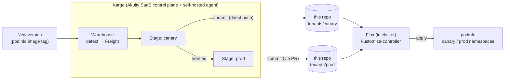

# gitops-tenants

**GitOps source of truth for the Kargo + Flux progressive-delivery demo.**

Flux watches this repo and applies each tenant "ring". **Kargo** promotes new
versions *into* this repo — ring by ring — behind verification and approval
gates. Kargo never touches a cluster directly; **the commit here is the hand-off**,
and Flux does the actual deploy.

> ⚠️ Demo / workshop repo — **generic content only** (podinfo + a version pin).
> No real infrastructure. The podinfo image tag stands in for
> "the thing being promoted."

---

## Where this fits



- **Kargo** detects a new version, opens a promotion, and **writes to this repo**
  (bumps a version pin). Canary pushes straight to `main`; prod opens a PR.
- **Flux** (in the workload cluster) reconciles this repo and applies each ring.
- The two are decoupled — they only meet at this repo.

---

## Repository layout

```
tenants/                    # tenant workloads (Kargo promotes into these)
  canary/                   # ring 1 — one pilot tenant   → namespace: canary
    namespace.yaml
    podinfo.yaml            # podinfo Deployment + Service
    kustomization.yaml      # image pin (newTag)  ← the version Kargo bumps
  prod/                     # ring 2 — the rest of the fleet → namespace: prod
    namespace.yaml
    podinfo.yaml
    kustomization.yaml

platform/                   # cluster platform addons (Flux-managed, GitOps)
  addons/                   # HelmRepositories + HelmReleases
    helmrepositories.yaml   # openbao / external-secrets / stakater repos
    openbao.yaml            # HelmRelease: OpenBao  (hub secrets, dev mode)
    external-secrets.yaml   # HelmRelease: External-Secrets Operator
    reloader.yaml           # HelmRelease: Reloader
    kustomization.yaml
  config/                   # applied after addons (dependsOn)
    clustersecretstore.yaml # ESO ClusterSecretStore → OpenBao
    kustomization.yaml
```

The **version pin** lives in each ring's `kustomization.yaml`:

```yaml
images:
  - name: ghcr.io/stefanprodan/podinfo
    newTag: "6.14.0"      # a "promotion" = bumping this value
```

A promotion changes only the target ring's file, so rings advance independently.

---

## Platform addons (`platform/`, Flux-managed)

The cluster's platform prerequisites are installed and managed by **Flux as
HelmReleases** (not imperative `helm install`), so they're version-controlled and
appear in the Flux UI:

- **OpenBao** (hub secrets, dev mode) — KV store the tenants pull from
- **External-Secrets Operator** — syncs secrets from OpenBao into namespaces
- **Reloader** — restarts workloads when a secret/config changes
- **ClusterSecretStore** (`platform/config`) — wires ESO → OpenBao

Delivered by two Flux Kustomizations with ordering: `platform-addons` (HelmReleases)
→ `platform-config` (ClusterSecretStore) via `dependsOn`.

> Notes: ESO's oversized CRDs are applied server-side out-of-band (a known ESO+Helm
> limitation), and OpenBao runs in **dev mode** (ephemeral) — both are demo choices,
> not production.

---

## How a promotion flows

1. Kargo's **Warehouse** discovers a new podinfo version → creates **Freight**.
2. Promote to **canary** → Kargo runs: `git-clone → kustomize-set-image → git-commit → git-push` (**straight to `main`**).
3. **Flux** applies `tenants/canary/` → canary podinfo rolls to the new version.
4. **Verification** (the gate): an Argo Rollouts `AnalysisRun` polls the canary's
   `/version` until it equals the promoted tag. Pass → Freight is "verified in canary".
5. Promote to **prod** → same steps, but the tail is **PR-based**:
   `git-push (new branch) → git-open-pr → git-wait-for-pr` — the promotion **pauses
   until a human merges the PR**.
6. On merge, Flux applies `tenants/prod/` → the rest of the fleet rolls.

### Two gates, two styles

| Ring | Promotion style | Gate | Nature |
|------|-----------------|------|--------|
| **canary** | direct push to `main` | **verification** (AnalysisRun on `/version`) | automated, post-deploy |
| **prod** | **PR-based** (branch → PR → wait-for-merge) | **PR review** (merge = approval) | human, pre-deploy |

If canary verification **fails**, the Freight is never marked verified, so **prod
never receives it** — the bad version halts at the single canary tenant.

---

## Current state

Both rings on **podinfo `6.14.0`** (promoted `6.13.0 → 6.14.0`: canary direct, prod via PR #1).

Recent history shows the promotion styles:
```
Merge pull request #1 ... prod.01kwe6xrc...      ← prod PR merge (human approval)
prod: promote podinfo to 6.14.0                   ← Kargo commit on the PR branch
canary: promote podinfo to 6.14.0                 ← Kargo commit direct to main
```

---

## What consumes this repo (defined outside this repo)

- **Flux** — a `GitRepository` pointing here + a `Kustomization` per ring
  (`tenant-canary` → `./tenants/canary`, `tenant-prod` → `./tenants/prod`).
- **Kargo** — a `Warehouse` (detects versions) and `canary` / `prod` `Stage`s
  (promotion steps that write here), living in the Akuity SaaS control plane.

Both are managed as code elsewhere in the demo workspace (`flux-apps/`, `kargo/`).

---

## Observe it

- **Flux UI** (Flux Operator status page) — sources, kustomizations, workloads.
- `flux get kustomizations` — which revision is applied per ring.
- `kargo get stages --project kargo-flux-demo` — freight + verification status.
- podinfo itself: `kubectl -n canary port-forward svc/podinfo 9898:9898` then
  `curl localhost:9898/version`.

---

## Roadmap — Terraform track (in progress)

To mirror the customer's real platform (Terraform-provisioned tenants):

- **Flux tf-controller** is installed; the tenant workloads will move from
  kustomize to a `Terraform` CR that applies a **Git-tagged TF module** (deploying
  podinfo).
- The **module `ref`** becomes the version source; Kargo's **`hcl-update`** step
  bumps it instead of `kustomize-set-image`.
- The tenant Terraform will wire **per-tenant ExternalSecrets** (from the OpenBao
  hub — already deployed under `platform/`) + **Reloader** annotations.

The promotion mechanism (Warehouse → canary → verify → prod) is unchanged — only
the executor (tf-controller) and the promotion step (`hcl-update`) differ.
